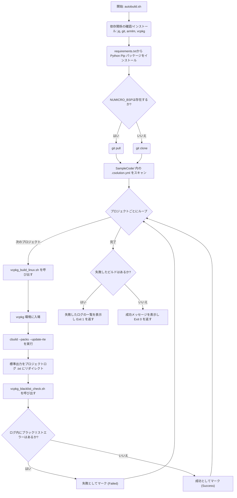

# NuMicro BSP用 VCPKG ビルドサブシステム

[English](README.md) | [繁體中文](README_zh-TW.md) | [简体中文](README_zh-CN.md) | [日本語](README_ja.md) | [한국어](README_ko.md)

このディレクトリは、VCPKG (`.csolution.yml`) 用に特別に準備された NuMicro CMSIS ベースのプロジェクト向けの自動化された継続的インテグレーション(CI) およびローカルビルドツールチェーン オーケストレーターです。Linux プラットフォームで Nuvoton ボードサポートパッケージ (BSP) プロジェクトの取得、準備、検証、およびコンパイルを自動化します。

## コアスクリプトおよびファイル

### 1. `autobuild.sh`
主なエントリーポイントであり、オーケストレータースクリプトです。実行時に以下の処理を自動的に処理します。
- **依存関係の自動プロビジョニング:** OS レベルの必要な依存パッケージ (`jq`, `git`, `python3`, `pip3`) を動的に検出し、インストールします。
- **ツールチェーンの調達:** Microsoft の `vcpkg` および Arm 公式の `armlm` ライセンスマネージャーが不足している場合、ソースからクローンして自動的に検証および構築します。
- **Arm ライセンス登録:** `armlm` を使用して `KEMDK-NUV1` 商業用 AC6 ツールチェーンライセンスを自動的にアクティブ化/再アクティブ化します。
- **Python 必須要件:** 基本のビルドツールに必要な `requirements.txt` 内の pip パッケージ要件を満たします。
- **BSP ソースコードの同期:** 特定のターゲットフレームワーク(例: `M3351BSP`)が存在するかどうかをインテリジェントに確認します。見つからない場合は `git clone` で取得し、そうでない場合は `git pull` を活用して最新状態を維持します。
- **反復コンパイルと分析:** BSP の `SampleCode` フォルダーの奥深くにある全ての `.csolution.yml` ファイルを検索し、それらに対して `vcpkg_build_linux.sh` をすっきりと実行します。生の出力を個別のログエントリ (`.txt`) にリダイレクトし、`vcpkg_blacklist_check.sh` を使用してログを積極的にスキャンし、最終的なコンパイルの異常をクリアに監査します。

### 2. `vcpkg_build_linux.sh`
各コンパイル対象ソリューションプロジェクトのために個別に呼び出される専用のコンテキストコンパイラです。
- **vcpkg 環境実行:** 構成の取得に必要なツールチェーンコンテキスト専用に完全に分離された `vcpkg` ビルド環境を明示的にアクティブ化します。
- **`cbuild` コンテキストマッピング:** `cbuild list contexts` コマンドを通じて ARM `.csolution.yml` をシームレスに呼び出し、コンパイルマトリックスを解決してコンテキストをネイティブに解析し、コードをコンパイルします。
- `--packs` および `--update-rte` を使用して、欠落している CMSIS パック (例: `NuMicroM33_DFP`) およびランタイム環境等の更新を暗黙的に自動処理します。

### 3. `vcpkg_blacklist_check.sh`
禁止された CI 構文をキャッチするための強力なコンパイル後ログプロセッサです。
- 非構造化された冗長なログを分析して、致命的な実行異常を見つけます。
- 行ごとに共通の警告やエラー (例: `[Fatal Error]`, ` error: `, ` warning: `, `Warning[`) をネイティブに検索して特定します。
- 問題のログに対応する指向性矢印を綿密に追跡して違反の文字列に注釈を付け、最終ログファイルを物理的に更新します。パイプラインを安全に中止するために発生した特定の異常の数を反映した終了コード(Exit code)を最終的に生成します。

### 4. `requirements.txt`
暗号化署名ツールの実行や、Nuvoton エコシステムロジックでのビルド後バイナリのサポートに必要な自動実行パッケージ (`cbor`, `intelhex`, `ecdsa`, `cryptography`, `click` など) の設定を保持する厳選された `pip` Python ロックファイルです。初期段階でネイティブに読み込まれます。

## 実行フロー図



## 利用ガイド
オーケストレーターをローカルで動的に実行するには、次のコマンドを実行するだけです：
```bash
./autobuild.sh
```
すべての過渡的なプロジェクトコンポーネントとツール環境が自動的にバックグラウンドで導入されます。これにより、ゼロ構成のローカル CI シミュレーションを実現し、GitHub Workflow の動作メカニズムと完全に自動同期します。
