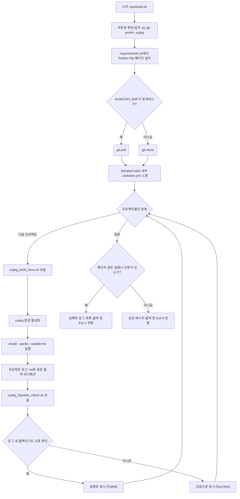

# NuMicro BSP용 VCPKG 빌드 서브시스템

[English](README.md) | [繁體中文](README_zh-TW.md) | [简体中文](README_zh-CN.md) | [日本語](README_ja.md) | [한국어](README_ko.md)

이 디렉토리는 VCPKG(`.csolution.yml`) 용으로 특별히 선별된 NuMicro CMSIS 기반 프로젝트를 위한 자동화된 지속적 통합(CI) 및 로컬 빌드 툴체인 오케스트레이터입니다. 원활한 배포를 위해 Linux 플랫폼에서 Nuvoton 보드 지원 패키지(BSP) 프로젝트의 검색, 준비, 검증 및 컴파일을 자동화합니다.

## 핵심 스크립트 및 파일

### 1. `autobuild.sh`
이것은 주요 진입점이자 오케스트레이터 스크립트입니다. 실행 시 다음 작업을 자동으로 처리합니다:
- **자동 의존성 구성:** 필수 OS 수준 의존성 설치(`jq`, `git`, `python3`, `pip3`)를 동적으로 감지하고 설치합니다.
- **툴체인 조달:** 시스템에 Microsoft의 `vcpkg` 및 Arm의 공식 `armlm` 라이선스 관리자가 부족한 경우 원본에서 확인, 복제 및 부트스트랩을 자동으로 구축합니다.
- **Arm 라이선스 등록:** `armlm`을 사용하여 `KEMDK-NUV1` 상업용 AC6 툴체인 라이선스를 자동으로 활성화/재활성화합니다.
- **Python 필수 구성 요소:** 빌드 도구에 기본적으로 필요한 `requirements.txt` 내의 pip 의존성 패키지를 설치합니다.
- **BSP 소스 코드 동기화:** 특정 대상 프레임워크(예: `M3351BSP`)가 존재하는지 지능적으로 확인합니다. 누락된 경우 `git clone`을 통해 가져오고, 그렇지 않은 경우 `git pull`을 통해 최신 상태를 유지합니다.
- **반복적인 컴파일 및 분석:** BSP의 `SampleCode` 폴더 깊숙한 곳에 있는 모든 개별 `.csolution.yml` 파일을 검색하여 `vcpkg_build_linux.sh`를 깔끔하게 실행하고, 그 결과를 격리된 로그 항목(`.txt`)에 리디렉션합니다. 그런 다음 `vcpkg_blacklist_check.sh`를 이용해 로그를 적극적으로 스캔하여 터미널에 결과를 우아하게 출력하고, 최종적으로 모든 컴파일 이상 여부를 감사합니다.

### 2. `vcpkg_build_linux.sh`
각 개별 CMSIS 솔루션 프로젝트를 위해 호출되는 전용 독립형 컨텍스트 컴파일러 스크립트입니다.
- **vcpkg 컨텍스트 실행:** 구성을 가져오는 데 필요한 툴체인 컨텍스트에 전용으로 분리된 로컬 환경에서 `vcpkg` 빌드 환경을 명시적으로 활성화합니다.
- **`cbuild` 컨텍스트 매핑:** `cbuild list contexts` 명령을 통해 ARM `.csolution.yml`을 매끄럽게 호출하여 컴파일 매트릭스를 해석하고, 해당 컨텍스트를 본질적으로 분석해 코드를 컴파일합니다.
- `--packs` 및 `--update-rte` 옵션을 통해 누락된 CMSIS 팩(예: `NuMicroM33_DFP`)의 검색 및 런타임 환경 구성의 업데이트를 암묵적으로 자동 처리합니다.

### 3. `vcpkg_blacklist_check.sh`
CI 환경에서 금지된 심각한 구문을 포착하는 강력한 컴파일 후 로그 처리기입니다.
- 구조화되지 않은 긴 로그를 분석하여 치명적인 실행 이상을 찾습니다.
- 일반적인 경고와 오류(예: `[Fatal Error]`, ` error: `, ` warning: `, `Warning[`)를 네이티브 수준에서 줄 단위로 검색하여 분석합니다.
- 특정 위반 문자열을 발견하면, 해당 문제가 발생한 로그를 정확하게 가리키는 방향 화살표를 세심하게 추적하고 주석으로 달아 최종 로그 파일을 물리적으로 업데이트합니다. 마지막으로, 고유한 비정상 발생 횟수를 반영한 특수한 종료 코드(Exit code)를 생성하여 CI 파이프라인 진행을 안전하게 차단합니다.

### 4. `requirements.txt`
신중하게 큐레이션된 `pip` Python 잠금 파일입니다. 자동 빌드 조율자가 실행되는 초기 단계에서 로드되며, Nuvoton 에코시스템 로직 환경에서 암호화 서명 도구를 실행하거나 빌드 후 추가 바이너리를 지원하는 데 필수적인 표준 패키지들(`cbor`, `intelhex`, `ecdsa`, `cryptography`, `click` 등)을 포함합니다.

## 실행 흐름도



## 사용 가이드
로컬 환경에서 오케스트레이터를 동적으로 직접 실행하려면 다음 명령을 실행하십시오:
```bash
./autobuild.sh
```
중간 프로젝트 구성 요소와 도구 환경은 백그라운드에서 자동으로 배포됩니다. 사전 구성이 필요 없는(Zero-config) 로컬 CI 시뮬레이션 환경을 완벽하게 재현하며, 이는 GitHub Workflow의 작동 메커니즘과 완전히 동일합니다.
