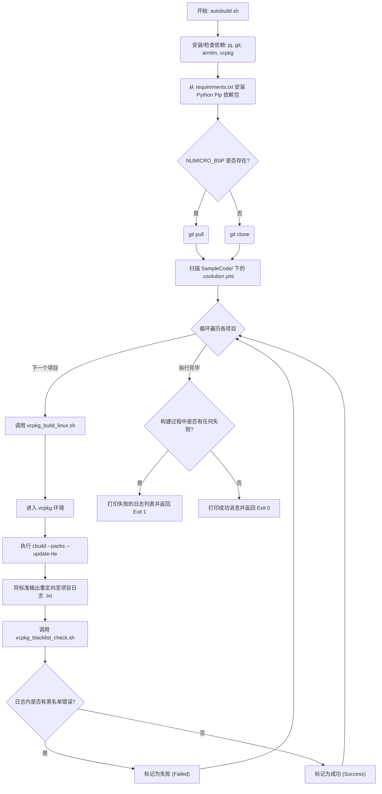

# VCPKG Build Subsystem for NuMicro BSP

[English](README.md) | [繁體中文](README_zh-TW.md) | [简体中文](README_zh-CN.md) | [日本語](README_ja.md) | [한국어](README_ko.md)

本目录为 NuMicro 采用 CMSIS 架构且专为 VCPKG (`.csolution.yml`) 精心打造的项目，提供了一个自动化的持续集成 (CI) 与本地构建工具链协调程序。此工具可在 Linux 平台上自动完成 Nuvoton 板级支持包 (BSP) 项目的获取、准备、验证及编译。

## 核心脚本与文件

### 1. `autobuild.sh`
这是您最主要的入口点与主要的协调脚本。执行时，它会自动处理以下事项：
- **依赖包自动配置：** 动态检测并安装必备的操作系统级别依赖项 (`jq`, `git`, `python3`, `pip3`)。
- **获取工具链：** 若系统缺少微软的 `vcpkg` 及 Arm 官方的 `armlm` 授权管理器，将会自动验证、从源头克隆并完成引导程序的构建。
- **Arm 授权登录：** 使用 `armlm` 自动激活/重新激活 `KEMDK-NUV1` 商业用途的 AC6 工具链授权。
- **Python 必备依赖：** 满足底层构建工具在 `requirements.txt` 中所规范的 pip 依赖需求。
- **BSP 源码同步：** 智能地检查您的特定目标框架 (例如 `M3351BSP`) 是否已经存在。若丢失，将使用 `git clone` 进行拉取；否则会通过 `git pull` 优雅地确保其处于最新状态。
- **迭代编译与分析：** 在 BSP 的 `SampleCode` 文件夹深处寻找每一个独立的 `.csolution.yml` 文件，逐一为它们干脆利落地触发 `vcpkg_build_linux.sh`，将原始结果重定向至独立的日志文件 (`.txt`) 中。接着，使用 `vcpkg_blacklist_check.sh` 积极地扫描日志，将结果优雅地显示于标准输出中，并在最后干净地审计所有的编译异常。

### 2. `vcpkg_build_linux.sh`
每当遇到一个独立的 CMSIS Solution 项目时，就会调用这支独立且专责的后台编译器脚本。
- **vcpkg 环境执行：** 针对获取配置时需要用到的工具链情境，明确地进入完全隔离的本地化 `vcpkg` 编译环境执行。
- **`cbuild` 情境映射：** 无缝地通过 `cbuild list contexts` 命令调用 ARM `.csolution.yml`，以解析出所有的编译矩阵排列，随后原生解析情境并据此编译代码。
- 通过 `--packs` 及 `--update-rte`，自动隐式地处理并更新丢失的 CMSIS 依赖包 (如 `NuMicroM33_DFP`) 以及运行时环境配置 (Run-Time Environments)。

### 3. `vcpkg_blacklist_check.sh`
一个强大、可于编译完成后自动捕捉严禁出现于 CI 环境中之不良语法特征的日志处理程序。
- 分析未结构化且繁冗的日志，以找出致命的执行异常。
- 通过逐行检查、原生搜索的方式，锁定常见的警告与错误字符串（如 `[Fatal Error]`、` error: `、` warning: `、`Warning[`）。
- 在标注特定的违规字符串时，会精心计算并追踪出对应的指向箭头，并将其指向出现问题的日志处，同时物理更新并修改最后定稿的日志文件。最后产生一个独特的退出代码来反映究竟发生了几次独特的异常，借此安全地中止 CI 流程的运行。

### 4. `requirements.txt`
一个精心整理过的 `pip` Python 锁定文件。在自动构建协调程序运行的早期阶段就会原生加载，其内部保存了 Nuvoton 生态逻辑下，在执行密码学签名工具或是支持构建后辅助二进制文件时，所必须具备的标准执行依赖 (`cbor`, `intelhex`, `ecdsa`, `cryptography`, `click` 等等)。

## 执行流程图



## 使用指南
如果要在本地动态执行此协调程序，只需要简单地执行以下命令：
```bash
./autobuild.sh
```
所有过渡的项目组件与工具环境都会自动在后台完成部署。为您带来一个完全无配置的本地 CI 模拟体验，并且完美等同并反映 GitHub Workflow 的内部运作机制。
